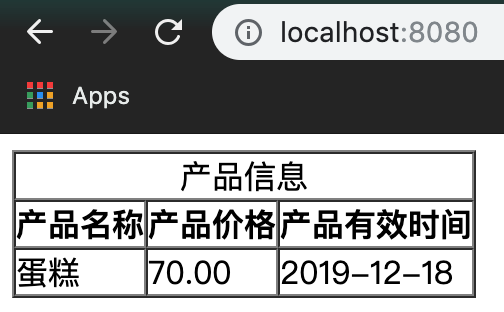

## Thymeleaf + Spring Boot 练习

### 练习描述
- 在build.gradle中配置Thymeleaf开发所需依赖
- 编写index.html文件，并完成下图所示页面

- 代码通过小步提交，并且每次提交的描述都要有意义
- 使用快捷键编码

### 环境描述
- java8
- Intellij-IDEA
### 如何开始
- 克隆模版库,在resources/templates/下完成需求
- 启动项目，若出现 Tomcat started on port(s): 8080 (http) 字样，并能打开localhost：8080页面，说明项目启动成功。
### 输出规范
- 完成需求的代码
- 项目根目录下必须包含运行截图